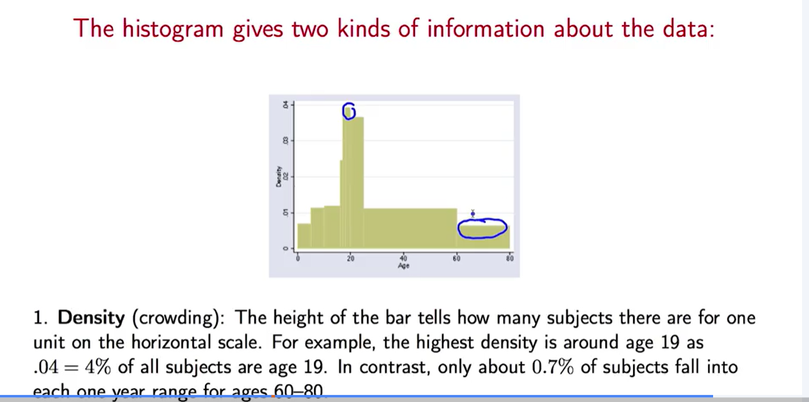
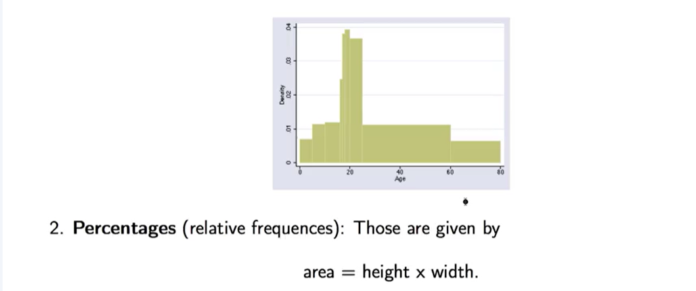
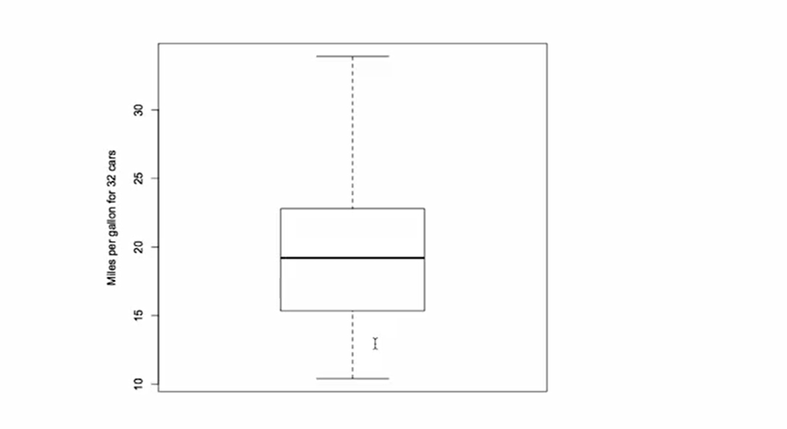
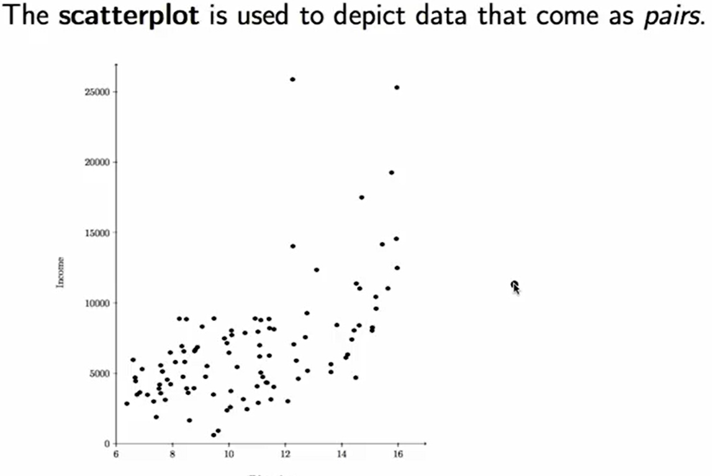
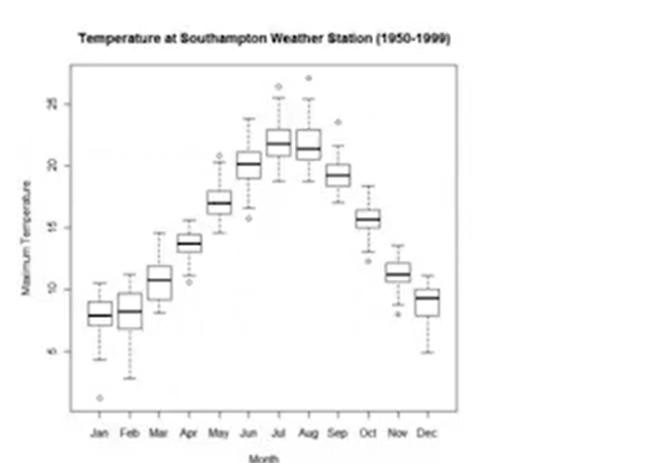
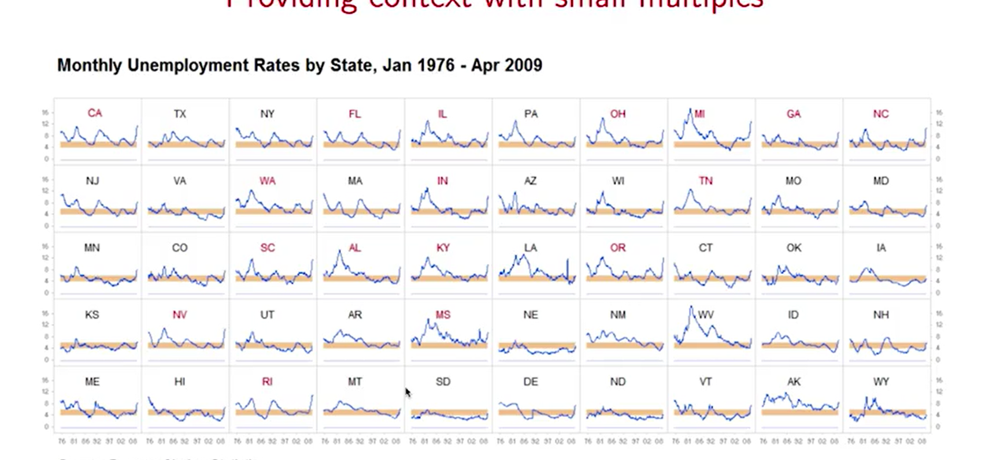

## Descriptive Statistics - Simplified Summary

- Descriptive statistics help us understand data using numbers and visuals.
- People find pictures (like graphs) easier to understand than long lists of numbers.
- Example: A graph of shuttle launch temperatures showed that the Challenger launch was much colder than others, helping explain the accident.
- Descriptive statistics are useful for:
  - Showing information clearly
  - Making it easier to think about and analyze data
  - Summarizing large amounts of data
Here’s a simplified version of your explanation on how to summarize and visualize data:

---

### 📊 **Visualizing and Summarizing Data**

There are two main ways to summarize data:

1. **Numerical summaries** – like averages and percentages.
2. **Graphical summaries** – like charts and plots.

People often prefer **visuals**, as they are easier to understand.

---

### 📌 **When the Data is Qualitative (Categories like colors or places):**

- Use **Pie Charts** or **Dot Plots**.

**Pie Chart**:

- Each slice shows the percentage of each category.
- Good for seeing what part of the whole a category represents.

**Dot Plot**:

- Dots represent categories on a horizontal line.
- Good for comparing between categories more easily.

> ✅ Example: For student origins, it's easier to **compare** in a dot plot but easier to **see total share** in a pie chart.

---

### 📌 **When the Data is Quantitative (Numbers):**

Use visual tools that show numbers on a **number line** because:

- The **order** and **distance** between values matter.

**Bar Graph**:

- Best for showing how often each number appears.
- Like a vertical dot plot.

**Histogram**:

- Similar to a bar graph but allows for different **bin widths**.
- Focuses on **area** of the bar, not just height.

> 🔸 The **area** of each block = percentage of data.
> 🔸 You can estimate percentages visually or by calculation:
>
> - `Area = Height × Width`
> - If height = 0.7% per year and width = 20 years → Area = 14%

**Density Scale** (vertical axis on histogram):

- Shows crowding per unit (like “percent per year”).
- Helps compare how packed or sparse data is in a range.

> 🔍 Example: Ages 60–80 cover 20 years with a low height (0.7% per year), so \~14% of people fall in this range.

---

- Choose the **right chart** based on data type (category vs number).
- **Pie charts** show share of total; **dot plots** show comparison.
- **Histograms** use **area** to represent percentages, not just height.
- **Density** tells how tightly data is packed per unit on the scale.

-----

Here’s a **simplified summary** of your explanation on **boxplots and scatter plots**, focusing on the key points in a concise and clear manner:

---

### 📦 **Boxplot (Box-and-Whisker Plot)**

- A **boxplot** shows **five key summary numbers** from the data:

  1. **Minimum** (lower whisker)
  2. **First Quartile (Q1)** – 25% of data is below this
  3. **Median (Q2)** – 50% of data is below this
  4. **Third Quartile (Q3)** – 75% of data is below this
  5. **Maximum** (upper whisker)

#### 📌 Example

- Data: Fuel consumption (miles per gallon) of 32 cars
- \~Min: 10 MPG
- \~Q1: 15 MPG
- \~Median: 19 MPG
- \~Q3: 30 MPG
- \~Max: 35 MPG

#### ✅ Advantages

- Takes up less space than a histogram.
- Great for **comparing multiple groups** side by side.
- Doesn't require choosing intervals like in histograms.
- Good for showing **spread**, **skew**, and **outliers**.

#### 📊 Use Case

- Comparing MPG across cars with different cylinder counts.
- Shows that **cars with fewer cylinders have better fuel economy**.
- Demonstrates the **principle of small multiples** (comparing multiple datasets in the same visual format).

---

### 🔷 **Scatter Plot**

- Used when data comes in **pairs** (two variables per data point).
- Plots values on a **coordinate grid (x, y)**.

#### 📌 Example

- **X-axis**: Years of education
- **Y-axis**: Income in dollars
- A person with 12 years of education may earn \~\$15,000.

#### ✅ Advantages

- Shows **relationships** between two variables.
- In this example, more education → **higher income**.
- Can reveal **trends, patterns, or correlations** (e.g., positive trend).

---

### 🎯 Summary

| Plot Type    | Shows                       | Best For                          |
| ------------ | --------------------------- | --------------------------------- |
| Boxplot      | 5-number summary            | Comparing multiple groups easily  |
| Scatter Plot | Relationship between 2 vars | Exploring trends and correlations |
| Histogram    | Frequency distribution      | Detailed shape of numeric data    |

Here's a **simplified and clear summary** of your explanation on the **purpose of statistical analysis** and the **principle of small multiples** in data visualization:

---

### 🎯 **Purpose of Statistical Analysis**

- The goal is to **compare observed data** to a **reference or baseline**.
- This comparison helps identify patterns, differences, or anomalies.
- To make comparisons easier, we often **visualize data with context**.

---

### 📘 **Edward Tufte’s Principle: Small Multiples**

From *The Visual Display of Quantitative Information* by **Edward Tufte**:

> “Small multiples” are a series of similar graphics, using the same scale and structure, shown side-by-side for comparison.

---

### 📦 **Example 1: Monthly Temperature Boxplots**

- A **boxplot** is shown for **each month** using 50 years of temperature data.
- Example: The January boxplot shows 50 values for January.
- This layout makes it easy to compare **how temperature varies across months**.
- ❗ **Why it works**: Our brain easily spots patterns when visuals are repeated and aligned.

---

### 📈 **Example 2: State-wise Unemployment Time Series**

- **Each state** has its own **time series plot** of unemployment (1976–2009).
- **X-axis**: Time
- **Y-axis**: Unemployment rate
- An orange band marks the **"normal" range** (4–6%).

✅ **What we observe:**

- Big spikes during the **financial crisis** in states like California & Michigan.
- States like Montana & South Dakota show more stable patterns.

---

### 🧠 **Why Small Multiples Work Well**

- Human brains are **excellent at comparing consistent visual patterns**.
- They enable **quick comparison** across groups, time, or categories without mental effort.
- Ideal for showing **change over time**, **group variation**, or **regional differences**.

---

### 🧩 Summary Table

| Concept              | Purpose                                     | Example                                  |
| -------------------- | ------------------------------------------- | ---------------------------------------- |
| Statistical Analysis | Compare data to a reference/baseline        | Temp changes over months or states       |
| Small Multiples      | Show multiple similar plots for comparison  | Monthly boxplots, state-wise time series |
| Context in Graphics  | Help interpret visuals with background info | Normal bands, consistent axes            |

## 🎨 Graphic Design in Data Visualization

- Modern tools let us create flashy graphics, but **flashiness often reduces clarity**.
- Example: A 3D bar chart comparing donations to three universities:
  - Harvard: \$683 million
  - Stanford: \$469 million
  - Columbia: \$359 million

### ❌ Problems with 3D Bar Charts
- Makes it harder to **read exact values** due to perspective.
- We **perceive volume**, but the data is about **height**.
- Bases of the bars are **misaligned**, adding confusion.
- Grid lines try to help, but only make the chart more cluttered.

### ✅ Better Alternative
- Use a **dot plot** or **simple 2D bar chart** to clearly compare values.
- Cleaner visuals = better understanding.

### 💡 Fun Reference
- Check out **Peter Norvig’s Gettysburg PowerPoint** parody to see how **overusing flashy slides** can ruin a powerful message.
